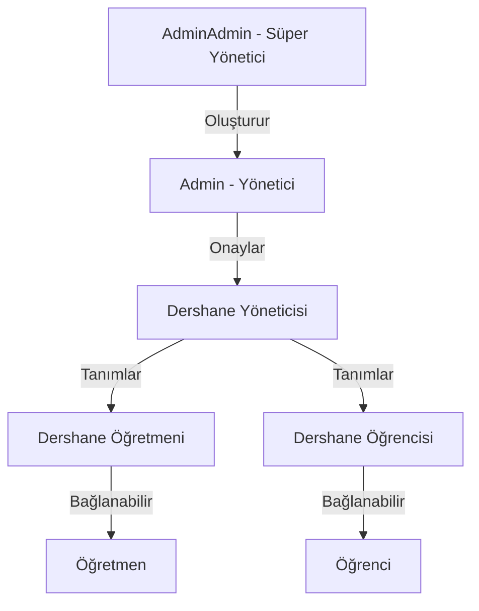

# KarneProject - Eğitim Platformu İmplementasyon Planı

## Proje Özeti

Okulları dijitale taşıyan, dershaneler için yönetim sistemi, öğretmen-öğrenci eşleştirme, soru/sınav paylaşımı ve sosyal öğrenme özelliklerini içeren kapsamlı bir eğitim platformu.

---

## Kullanıcı Rolleri Hiyerarşisi



---

## Faz 1: Temel Mimari ve Kullanıcı Yönetimi

### Backend Değişiklikler

#### Yeni Veritabanı Modelleri

##### 1. Kullanıcı ve Rol Sistemi

**AppUser Güncellemesi** (Mevcut modeli genişlet)

```csharp
public class AppUser
{
    public int Id { get; set; }
    public string UserName { get; set; }
    public string Email { get; set; }
    public byte[] PasswordHash { get; set; }
    public byte[] PasswordSalt { get; set; }

    // YENİ: Rol Sistemi
    public UserRole Role { get; set; } // Admin, AdminAdmin, Teacher, Student, SchoolManager
    public UserType UserType { get; set; } // Standalone, SchoolAffiliated

    // YENİ: Profil Bilgileri
    public string? FirstName { get; set; }
    public string? LastName { get; set; }
    public string? PhoneNumber { get; set; }
    public string? ProfileImageUrl { get; set; }
    public DateTime? DateOfBirth { get; set; }

    // YENİ: Hesap Durumu
    public AccountStatus AccountStatus { get; set; } // Active, Pending, Suspended, Deleted
    public bool IsEmailVerified { get; set; }
    public DateTime CreatedAt { get; set; }
    public DateTime? LastLoginAt { get; set; }

    // YENİ: İlişkiler
    public int? SchoolId { get; set; }
    public School? School { get; set; }

    // Navigation Properties
    public ICollection<UserSchoolConnection>? SchoolConnections { get; set; }
    public TeacherProfile? TeacherProfile { get; set; }
    public StudentProfile? StudentProfile { get; set; }
}

public enum UserRole
{
    AdminAdmin = 0,
    Admin = 1,
    SchoolManager = 2,
    SchoolTeacher = 3,
    SchoolStudent = 4,
    IndependentTeacher = 5,
    IndependentStudent = 6
}

public enum AccountStatus
{
    Pending = 0,      // Onay bekliyor
    Active = 1,       // Aktif
    Suspended = 2,    // Askıya alınmış
    Deleted = 3       // Silinmiş
}
```

##### 2. Dershane/Okul Modeli

```csharp
public class School
{
    public int Id { get; set; }
    public string Name { get; set; }
    public string? Description { get; set; }
    public string? Address { get; set; }
    public string? PhoneNumber { get; set; }
    public string? Email { get; set; }
    public string? Website { get; set; }
    public string? LogoUrl { get; set; }

    // Ödeme ve Abonelik
    public SubscriptionPlan SubscriptionPlan { get; set; }
    public DateTime SubscriptionStartDate { get; set; }
    public DateTime SubscriptionEndDate { get; set; }
    public bool IsActive { get; set; }

    // Yönetici
    public int ManagerId { get; set; }
    public AppUser Manager { get; set; }

    // İlişkiler
    public ICollection<Classroom> Classrooms { get; set; }
    public ICollection<AppUser> Users { get; set; }

    public DateTime CreatedAt { get; set; }
    public DateTime UpdatedAt { get; set; }
}

public enum SubscriptionPlan
{
    Trial = 0,        // 30 gün deneme
    Basic = 1,        // 50 öğrenci
    Standard = 2,     // 200 öğrenci
    Premium = 3,      // Sınırsız
    Enterprise = 4    // Özel anlaşma
}
```

##### 3. Sınıf Modeli

```csharp
public class Classroom
{
    public int Id { get; set; }
    public string Name { get; set; }
    public string? Description { get; set; }
    public int SchoolId { get; set; }
    public School School { get; set; }

    // Sınıf Bilgileri
    public string? Grade { get; set; }      // 9, 10, 11, 12, TYT, AYT, vb.
    public string? Branch { get; set; }     // A, B, Sayısal, Sözel, vb.
    public int MaxStudents { get; set; }
    public bool IsActive { get; set; }

    // İlişkiler
    public ICollection<ClassroomTeacher> Teachers { get; set; }
    public ICollection<ClassroomStudent> Students { get; set; }
    public ICollection<ClassroomPost> Posts { get; set; }
    public ICollection<Exam> Exams { get; set; }

    public DateTime CreatedAt { get; set; }
    public int CreatedBy { get; set; }
}

// Many-to-Many İlişkiler
public class ClassroomTeacher
{
    public int ClassroomId { get; set; }
    public Classroom Classroom { get; set; }
    public int TeacherId { get; set; }
    public AppUser Teacher { get; set; }
    public DateTime AssignedAt { get; set; }
}

public class ClassroomStudent
{
    public int ClassroomId { get; set; }
    public Classroom Classroom { get; set; }
    public int StudentId { get; set; }
    public AppUser Student { get; set; }
    public DateTime EnrolledAt { get; set; }
}
```

##### 4. Öğretmen ve Öğrenci Profilleri

```csharp
public class TeacherProfile
{
    public int Id { get; set; }
    public int UserId { get; set; }
    public AppUser User { get; set; }

    // Özel Ders Bilgileri
    public bool OffersPrivateLessons { get; set; }
    public decimal? HourlyRate { get; set; }
    public string? LessonDescription { get; set; }
    public string? Subjects { get; set; }             // JSON: ["Matematik", "Fizik"]
    public string? AvailableDays { get; set; }        // JSON: ["Monday", "Wednesday"]
    public bool IsPremiumListed { get; set; }         // Öne çıkarılmış mı?

    // İstatistikler
    public int TotalStudents { get; set; }
    public decimal AverageRating { get; set; }
    public int TotalQuestions { get; set; }
    public int TotalExams { get; set; }

    public DateTime CreatedAt { get; set; }
}

public class StudentProfile
{
    public int Id { get; set; }
    public int UserId { get; set; }
    public AppUser User { get; set; }

    // Performans Görünürlüğü
    public bool IsPerformancePublic { get; set; }    // Diğer öğrenciler görebilir mi?

    // İstatistikler
    public int TotalExamsTaken { get; set; }
    public decimal OverallAverage { get; set; }
    public int TotalQuestionsSolved { get; set; }
    public int TotalQuestionsShared { get; set; }

    // Güçlü/Zayıf Konular (JSON)
    public string? StrongTopics { get; set; }        // JSON: [{"subject": "Math", "topic": "Calculus", "score": 95}]
    public string? WeakTopics { get; set; }

    public DateTime CreatedAt { get; set; }
}
```

##### 5. Sınav ve Karne Modelleri

```csharp
public class Exam
{
    public int Id { get; set; }
    public string Title { get; set; }
    public string? Description { get; set; }

    // Sınav Tipi
    public ExamType ExamType { get; set; }           // Mock, Quiz, Homework, Official
    public string Subject { get; set; }              // Matematik, Fizik, vb.
    public int TotalQuestions { get; set; }
    public int Duration { get; set; }                // Dakika

    // Oluşturucu
    public int CreatedBy { get; set; }
    public AppUser Creator { get; set; }

    // Hedef Kitle
    public int? ClassroomId { get; set; }
    public Classroom? Classroom { get; set; }
    public int? SchoolId { get; set; }
    public School? School { get; set; }
    public bool IsPublic { get; set; }               // Herkes görebilir mi?

    // İlişkiler
    public ICollection<ExamQuestion> Questions { get; set; }
    public ICollection<StudentExamResult> Results { get; set; }

    public DateTime CreatedAt { get; set; }
    public DateTime? ScheduledFor { get; set; }
}

public enum ExamType
{
    Quiz = 0,
    MockExam = 1,
    Homework = 2,
    MidtermExam = 3,
    FinalExam = 4,
    Practice = 5
}

public class ExamQuestion
{
    public int Id { get; set; }
    public int ExamId { get; set; }
    public Exam Exam { get; set; }
    public int QuestionId { get; set; }
    public Question Question { get; set; }
    public int OrderNumber { get; set; }
    public int Points { get; set; }
}

public class StudentExamResult
{
    public int Id { get; set; }
    public int ExamId { get; set; }
    public Exam Exam { get; set; }
    public int StudentId { get; set; }
    public AppUser Student { get; set; }

    // Sonuçlar
    public int CorrectAnswers { get; set; }
    public int WrongAnswers { get; set; }
    public int EmptyAnswers { get; set; }
    public decimal Score { get; set; }
    public decimal Percentage { get; set; }

    // Konu Bazlı Analiz (JSON)
    public string? TopicAnalysis { get; set; }       // [{"topic": "Türev", "correct": 5, "wrong": 2}]

    // Optik Okuyucu Verisi
    public string? OpticalReaderData { get; set; }   // TXT dosya içeriği

    public DateTime CompletedAt { get; set; }
}

public class ReportCard
{
    public int Id { get; set; }
    public int StudentId { get; set; }
    public AppUser Student { get; set; }

    // Karne Bilgileri
    public string Title { get; set; }
    public DateTime PeriodStart { get; set; }
    public DateTime PeriodEnd { get; set; }

    // Genel Performans
    public decimal OverallAverage { get; set; }

    // Detaylı Analiz (JSON)
    public string SubjectAnalysis { get; set; }      // Her ders için ortalama, güçlü/zayıf konular

    // Gönderici
    public int CreatedBy { get; set; }
    public AppUser CreatedByUser { get; set; }
    public bool IsSent { get; set; }
    public DateTime? SentAt { get; set; }

    public DateTime CreatedAt { get; set; }
}
```

##### 6. Soru Paylaşımı Modelleri

```csharp
public class Question
{
    public int Id { get; set; }
    public string Content { get; set; }              // Soru metni veya resim URL'i
    public QuestionType Type { get; set; }           // MultipleChoice, TrueFalse, OpenEnded

    // Kategorilendirme
    public string Subject { get; set; }              // Matematik, Fizik, vb.
    public string Topic { get; set; }                // Türev, Hareket, vb.
    public string? Subtopic { get; set; }
    public string? Tags { get; set; }                // JSON: ["YKS", "2024", "Zor"]

    // Cevap
    public string? CorrectAnswer { get; set; }
    public string? Explanation { get; set; }         // Çözüm açıklaması

    // Oluşturucu
    public int CreatedBy { get; set; }
    public AppUser Creator { get; set; }

    // Görünürlük
    public bool IsPublic { get; set; }
    public int? SchoolId { get; set; }

    // Sosyal Özellikler
    public int ViewCount { get; set; }
    public int LikeCount { get; set; }
    public int CommentCount { get; set; }

    // İlişkiler
    public ICollection<QuestionLike> Likes { get; set; }
    public ICollection<QuestionComment> Comments { get; set; }
    public ICollection<ExamQuestion> ExamQuestions { get; set; }

    public DateTime CreatedAt { get; set; }
}

public enum QuestionType
{
    MultipleChoice = 0,
    TrueFalse = 1,
    OpenEnded = 2,
    FillInTheBlank = 3
}

public class QuestionLike
{
    public int Id { get; set; }
    public int QuestionId { get; set; }
    public Question Question { get; set; }
    public int UserId { get; set; }
    public AppUser User { get; set; }
    public DateTime CreatedAt { get; set; }
}

public class QuestionComment
{
    public int Id { get; set; }
    public int QuestionId { get; set; }
    public Question Question { get; set; }
    public int UserId { get; set; }
    public AppUser User { get; set; }
    public string Content { get; set; }
    public int? ParentCommentId { get; set; }        // Alt yorum için
    public DateTime CreatedAt { get; set; }
}
```

##### 7. Mesajlaşma ve Bildirim Modelleri

```csharp
public class ClassroomPost
{
    public int Id { get; set; }
    public int ClassroomId { get; set; }
    public Classroom Classroom { get; set; }
    public int UserId { get; set; }
    public AppUser User { get; set; }

    // İçerik
    public string Content { get; set; }
    public PostType Type { get; set; }               // Text, Question, Exam, Announcement
    public int? QuestionId { get; set; }
    public Question? Question { get; set; }
    public int? ExamId { get; set; }
    public Exam? Exam { get; set; }

    // Dosya Ekleri
    public string? Attachments { get; set; }         // JSON: [{"url": "...", "type": "pdf"}]

    public DateTime CreatedAt { get; set; }
}

public enum PostType
{
    Text = 0,
    Question = 1,
    Exam = 2,
    Announcement = 3,
    ReportCard = 4
}

public class DirectMessage
{
    public int Id { get; set; }
    public int SenderId { get; set; }
    public AppUser Sender { get; set; }
    public int ReceiverId { get; set; }
    public AppUser Receiver { get; set; }

    public string Content { get; set; }
    public bool IsRead { get; set; }
    public DateTime? ReadAt { get; set; }

    public DateTime CreatedAt { get; set; }
}

public class Notification
{
    public int Id { get; set; }
    public int UserId { get; set; }
    public AppUser User { get; set; }

    public NotificationType Type { get; set; }
    public string Title { get; set; }
    public string Message { get; set; }
    public string? ActionUrl { get; set; }

    public bool IsRead { get; set; }
    public DateTime? ReadAt { get; set; }
    public DateTime CreatedAt { get; set; }
}

public enum NotificationType
{
    NewMessage = 0,
    NewExam = 1,
    ExamResult = 2,
    NewReportCard = 3,
    NewFollower = 4,
    NewComment = 5,
    NewLike = 6
}
```

##### 8. Takip ve Sosyal Özellikler

```csharp
public class UserFollow
{
    public int Id { get; set; }
    public int FollowerId { get; set; }
    public AppUser Follower { get; set; }
    public int FollowingId { get; set; }
    public AppUser Following { get; set; }
    public DateTime CreatedAt { get; set; }
}
```

##### 9. Ders Programı ve Zamanlayıcı

```csharp
public class Schedule
{
    public int Id { get; set; }
    public int UserId { get; set; }
    public AppUser User { get; set; }

    public string Title { get; set; }
    public string? Subject { get; set; }
    public DayOfWeek DayOfWeek { get; set; }
    public TimeSpan StartTime { get; set; }
    public TimeSpan EndTime { get; set; }
    public string? Location { get; set; }
    public string? Notes { get; set; }

    public DateTime CreatedAt { get; set; }
}

public class StudySession
{
    public int Id { get; set; }
    public int UserId { get; set; }
    public AppUser User { get; set; }

    public string Subject { get; set; }
    public DateTime StartTime { get; set; }
    public DateTime? EndTime { get; set; }
    public int? QuestionsCompleted { get; set; }
    public int? PagesRead { get; set; }

    // Hız Performansı
    public double? AverageTimePerQuestion { get; set; }  // Saniye

    public DateTime CreatedAt { get; set; }
}
```

---

### API Endpoint Yapısı

#### Authentication & User Management

- `POST /api/auth/register` - Kayıt ol
- `POST /api/auth/login` - Giriş yap
- `POST /api/auth/verify-email` - Email doğrula
- `POST /api/auth/forgot-password` - Şifre sıfırlama
- `GET /api/users/profile` - Profil görüntüle
- `PUT /api/users/profile` - Profil güncelle

#### Admin Operations

- `GET /api/admin/pending-schools` - Onay bekleyen dershaneler
- `POST /api/admin/approve-school/{id}` - Dershane onayla
- `POST /api/admin/create-admin` - Yeni admin oluştur (Sadece AdminAdmin)
- `GET /api/admin/users` - Kullanıcı listesi
- `PUT /api/admin/users/{id}/status` - Kullanıcı durumunu değiştir

#### School Management

- `POST /api/schools` - Dershane oluştur (başvuru)
- `GET /api/schools/my-school` - Kendi dershane bilgilerim
- `PUT /api/schools/{id}` - Dershane bilgilerini güncelle
- `GET /api/schools/{id}/statistics` - Dershane istatistikleri

#### Classroom Management

- `POST /api/classrooms` - Sınıf oluştur
- `GET /api/classrooms` - Sınıf listesi
- `GET /api/classrooms/{id}` - Sınıf detayları
- `POST /api/classrooms/{id}/students` - Öğrenci ekle
- `POST /api/classrooms/{id}/teachers` - Öğretmen ekle
- `DELETE /api/classrooms/{id}/students/{studentId}` - Öğrenci çıkar
- `GET /api/classrooms/{id}/report-card` - Sınıf karnesi

#### Question Management

- `POST /api/questions` - Soru oluştur
- `GET /api/questions` - Soru listesi (filtreleme ile)
- `GET /api/questions/{id}` - Soru detayı
- `POST /api/questions/{id}/like` - Beğen
- `POST /api/questions/{id}/comment` - Yorum yap
- `GET /api/questions/feed` - Takip edilenlerin soruları
- `GET /api/questions/explore` - Keşfet (popüler sorular)

#### Exam Management

- `POST /api/exams` - Sınav oluştur
- `GET /api/exams` - Sınav listesi
- `GET /api/exams/{id}` - Sınav detayı
- `POST /api/exams/{id}/assign-classroom` - Sınıfa ata
- `POST /api/exams/{id}/upload-results` - Optik okuyucu sonuçlarını yükle
- `GET /api/exams/{id}/results` - Sınav sonuçları
- `GET /api/exams/{examId}/students/{studentId}/result` - Öğrenci sınav sonucu

#### Report Card

- `POST /api/report-cards` - Karne oluştur
- `GET /api/report-cards/my-cards` - Karnelerim
- `POST /api/report-cards/{id}/send` - Karne gönder
- `GET /api/students/{id}/performance` - Öğrenci performansı

#### Messaging

- `POST /api/classrooms/{id}/posts` - Sınıfa mesaj/soru/sınav paylaş
- `GET /api/classrooms/{id}/posts` - Sınıf paylaşımları
- `POST /api/messages` - Özel mesaj gönder
- `GET /api/messages` - Mesajlarım

#### Social Features

- `POST /api/users/{id}/follow` - Takip et
- `DELETE /api/users/{id}/follow` - Takibi bırak
- `GET /api/users/{id}/followers` - Takipçiler
- `GET /api/users/{id}/following` - Takip edilenler

#### Teacher Features

- `PUT /api/teachers/profile` - Özel ders bilgilerini güncelle
- `GET /api/teachers/search` - Öğretmen ara

#### Schedule & Study Tracker

- `POST /api/schedules` - Ders programı ekle
- `GET /api/schedules` - Programım
- `POST /api/study-sessions` - Çalışma seansı başlat
- `PUT /api/study-sessions/{id}/end` - Çalışma seansı bitir

---

### Frontend Yapısı

#### Ana Sayfa Yapısı

```text
📂 src/app
├── 📂 core
│   ├── 📂 guards
│   │   ├── auth.guard.ts
│   │   ├── role.guard.ts (YENİ)
│   │   └── school-admin.guard.ts (YENİ)
│   ├── 📂 interceptors
│   │   ├── auth.interceptor.ts
│   │   └── error.interceptor.ts (YENİ)
│   ├── 📂 services
│   │   ├── 📂 api
│   │   │   ├── auth.service.ts
│   │   │   ├── school.service.ts (YENİ)
│   │   │   ├── classroom.service.ts (YENİ)
│   │   │   ├── exam.service.ts (YENİ)
│   │   │   ├── question.service.ts (YENİ)
│   │   │   ├── report-card.service.ts (YENİ)
│   │   │   └── messaging.service.ts (YENİ)
│   │   └── 📂 state
│   │       ├── auth-state.service.ts
│   │       └── user-state.service.ts (YENİ)
│   └── 📂 models
│       ├── 📂 entities
│       │   ├── user.model.ts
│       │   ├── school.model.ts (YENİ)
│       │   ├── classroom.model.ts (YENİ)
│       │   ├── exam.model.ts (YENİ)
│       │   ├── question.model.ts (YENİ)
│       │   └── report-card.model.ts (YENİ)
│       ├── 📂 requests
│       └── 📂 responses
│
├── 📂 features
│   ├── 📂 auth (Mevcut)
│   ├── 📂 admin (YENİ)
│   │   ├── 📂 school-approval
│   │   ├── 📂 user-management
│   │   └── 📂 admin-dashboard
│   ├── 📂 school (YENİ)
│   │   ├── 📂 school-dashboard
│   │   ├── 📂 classroom-management
│   │   ├── 📂 student-management
│   │   └── 📂 teacher-management
│   ├── 📂 classroom (YENİ)
│   │   ├── 📂 classroom-feed
│   │   ├── 📂 classroom-members
│   │   └── 📂 classroom-reports
│   ├── 📂 exam (YENİ)
│   │   ├── 📂 exam-create
│   │   ├── 📂 exam-list
│   │   ├── 📂 exam-detail
│   │   └── 📂 optical-reader-upload
│   ├── 📂 question (YENİ)
│   │   ├── 📂 question-create
│   │   ├── 📂 question-feed
│   │   ├── 📂 question-explore
│   │   └── 📂 question-detail
│   ├── 📂 report-card (YENİ)
│   │   ├── 📂 report-card-create
│   │   ├── 📂 report-card-view
│   │   └── 📂 student-performance
│   ├── 📂 messaging (YENİ)
│   │   ├── 📂 direct-messages
│   │   └── 📂 notifications
│   ├── 📂 profile (YENİ)
│   │   ├── 📂 student-profile
│   │   └── 📂 teacher-profile
│   └── 📂 schedule (YENİ)
│       ├── 📂 weekly-schedule
│       └── 📂 study-tracker
│
└── 📂 shared
    ├── 📂 components
    │   ├── navbar (Güncellenecek)
    │   ├── sidebar (YENİ)
    │   ├── user-card (YENİ)
    │   ├── question-card (YENİ)
    │   ├── exam-card (YENİ)
    │   └── notification-bell (YENİ)
    └── 📂 pipes
        ├── time-ago.pipe.ts (YENİ)
        └── subject-icon.pipe.ts (YENİ)
```

---

## Geliştirme Sırası (Faz 1)

### Sprint 1: Temel Altyapı (1-2 Hafta)

1. ✅ Backend temizliği (anime dosyaları kaldırıldı)
2. Backend: Yeni veritabanı modellerini oluştur
3. Backend: Migration'ları çalıştır
4. Frontend: Yeni servis ve model dosyalarını oluştur
5. Frontend: AuthGuard'a rol kontrolü ekle

### Sprint 2: Kullanıcı Yönetimi ve Dershane Sistemi (2 Hafta)

1. Backend: Dershane CRUD operasyonları
2. Backend: Admin onay sistemi
3. Frontend: Admin paneli
4. Frontend: Dershane başvuru formu
5. Frontend: Dershane yönetim paneli

### Sprint 3: Sınıf Yönetimi (1-2 Hafta)

1. Backend: Sınıf CRUD
2. Backend: Öğrenci/Öğretmen atama
3. Frontend: Sınıf oluşturma
4. Frontend: Sınıf üye yönetimi
5. Frontend: Sınıf feed (mesajlaşma)

### Sprint 4: Sınav ve Karne Sistemi (2-3 Hafta)

1. Backend: Sınav oluşturma
2. Backend: Optik okuyucu entegrasyonu
3. Backend: Karne oluşturma algoritması
4. Frontend: Sınav oluşturma arayüzü
5. Frontend: Optik okuyucu dosya yükleme
6. Frontend: Karne görüntüleme

### Sprint 5: Soru Paylaşımı ve Sosyal Özellikler (2 Hafta)

1. Backend: Soru CRUD
2. Backend: Beğeni ve yorum sistemi
3. Backend: Takip sistemi
4. Frontend: Soru oluşturma
5. Frontend: Ana sayfa feed
6. Frontend: Keşfet sayfası

---

## Kullanılan Teknolojiler

### Backend

- **Framework:** .NET 8 Web API
- **ORM:** Entity Framework Core
- **Veritabanı:** SQL Server / PostgreSQL
- **Authentication:** JWT Bearer Token
- **File Storage:** Local / Azure Blob Storage
- **Real-time:** SignalR (mesajlaşma için)

### Frontend

- **Framework:** Angular 17+
- **State Management:** Signals
- **UI Components:** Angular Material / PrimeNG
- **Charts:** Chart.js / ApexCharts (performans grafikleri için)
- **File Upload:** ng2-file-upload

---

## Güvenlik ve İyileştirmeler

### Backend

- ✅ Global Exception Handler Middleware
- ✅ Request Logging Middleware
- ✅ Rate Limiting (API koruması)
- ✅ Input Validation (Data Annotations)
- ✅ Role-based Authorization

### Frontend

- ✅ HTTP Interceptor (Token ekleme)
- ✅ Error Interceptor (401 → Logout)
- ✅ Route Guards (Rol kontrolü)
- ✅ Form Validation (Reactive Forms)

---

## Sonraki Fazlar (İlerleyen Dönemler)

### Faz 2: Gelişmiş Özellikler

- Özel ders öğretmen arama ve filtreleme
- Premium listing (öne çıkma)
- Ders programı ve senkronizasyon
- Zamanlayıcı ve hız performans takibi
- Mobil uygulama (React Native / Flutter)

### Faz 3: Analitik ve Raporlama

- Gelişmiş performans grafikleri
- Konu bazlı güçlü/zayıf alan tespiti
- Sınıf karşılaştırmaları
- Öğretmen performans metrikleri

### Faz 4: Ölçeklendirme

- Redis caching
- CDN entegrasyonu
- Load balancing
- Microservices mimarisi
